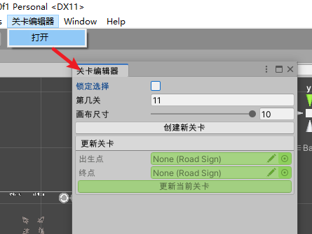
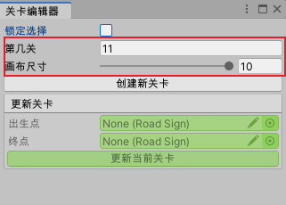
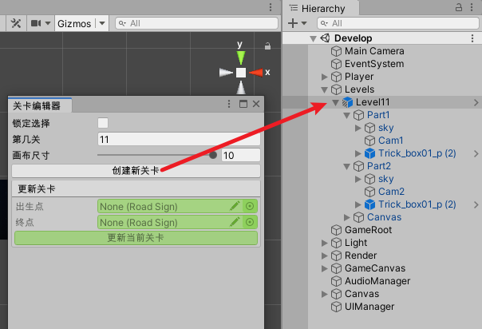
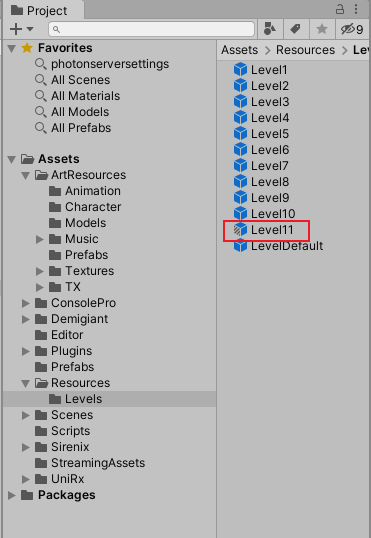
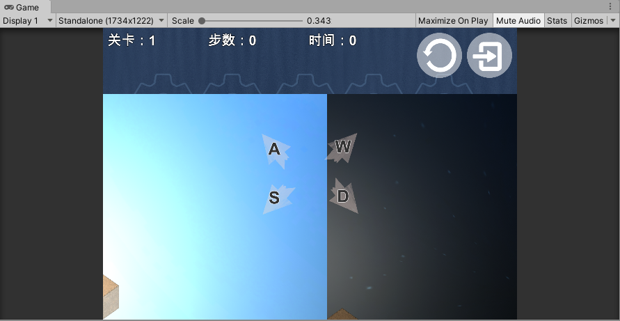
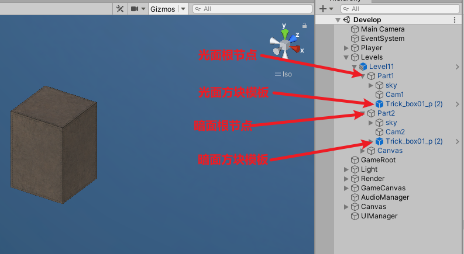
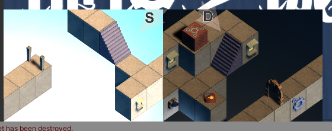
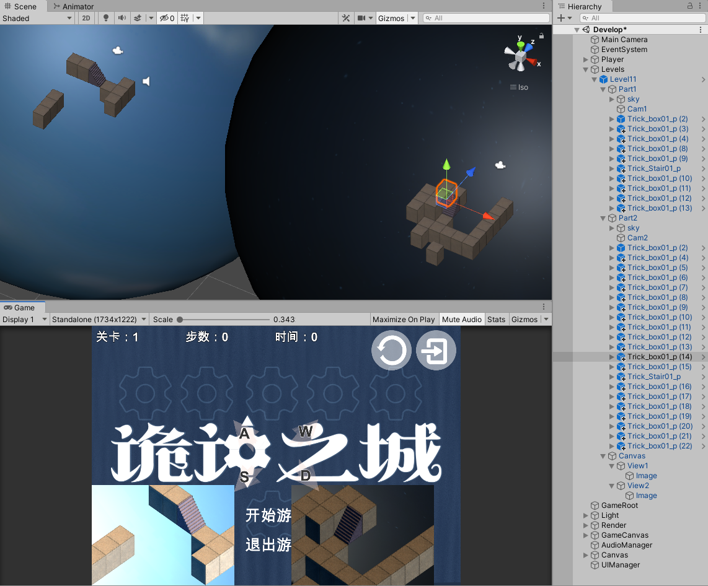

# 操作文档

### 打开关卡编辑器

### 创建新关卡

**举个栗子**

创建第11关，大小是10*10

点击创建新关卡

此时，第11关的骨架已经创建好了

> 新关卡资源的位置：Assets/Resources/Levels/Level11.prefab
>
> 

接下来就是往11关里添加各种部件了

### 关卡结构介绍

看一下**Game**窗口，可以实时预览关卡修改后的效果

看一下**Hierarchy**面板中新关卡的结构

### 添加部件

**举个栗子**搭建下图关卡，原版第3关

通过复制粘贴所有的方块位置都搭好了

把初始点和终点绑好，点击更新当前关卡

接下来去预制体里修改

