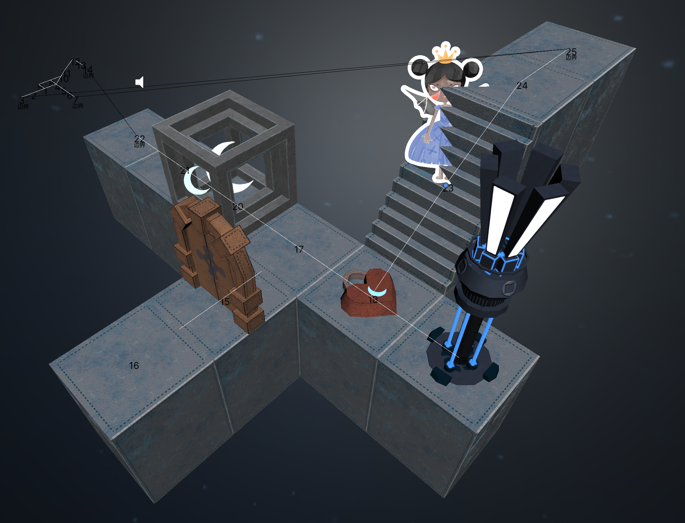
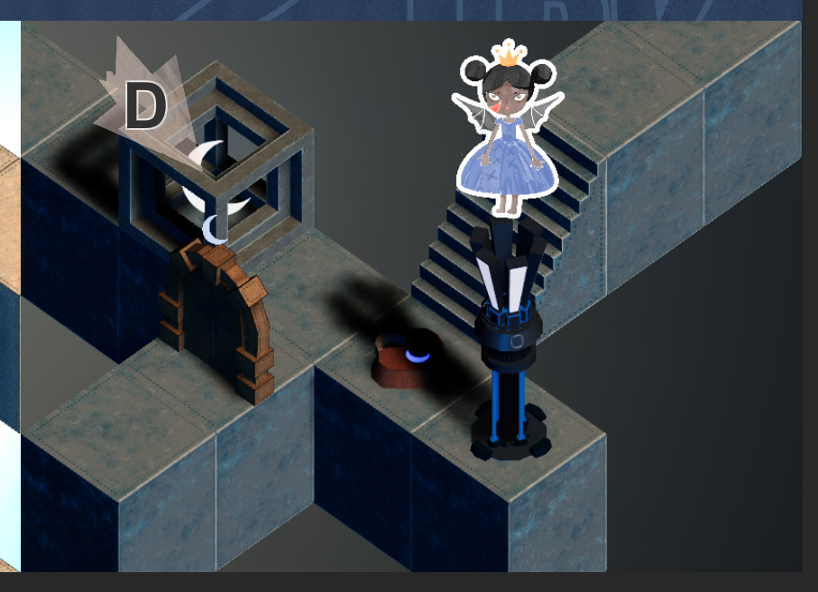
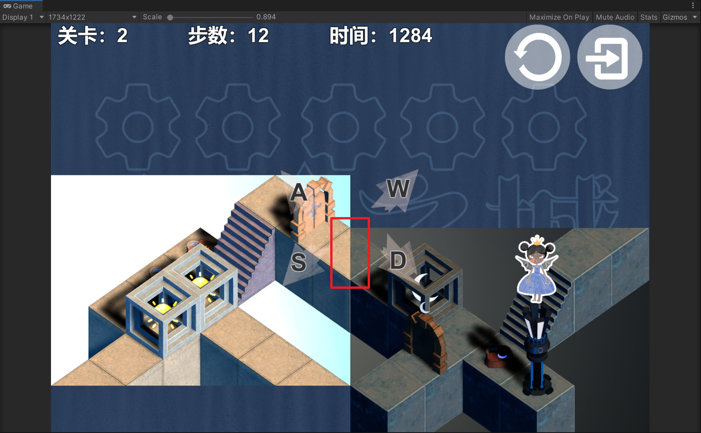
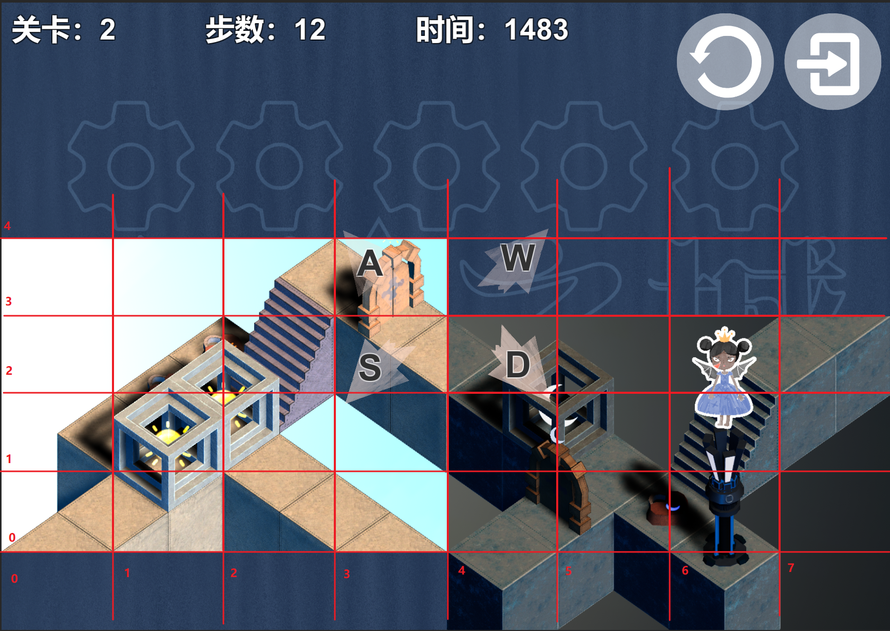
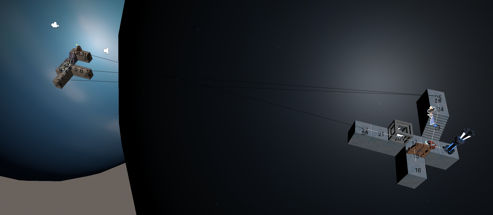
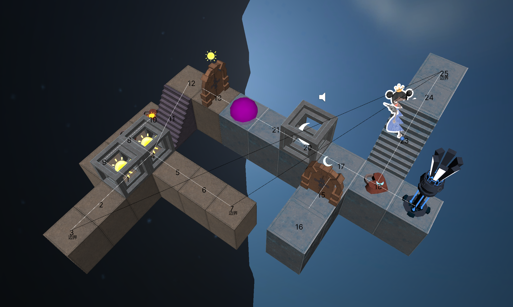

# 诡计之城玩法实现方式

通过对场景中的每个道路进行路径连线，让角色在路径线上移动。

游戏画面分为光暗两个面，通过拖动两个面，使其在视觉上看起来能组成连接的道路

游戏中会记录关卡中两个面的相对坐标

上图中的光面和暗面的相对坐标为，暗面坐标-光面坐标=（4，-1）

如果相对坐标满足预先设定好的值（4，-1）

则对窗口背后实际的两块光暗场景，按预定的坐标偏移进行拼接

这样就完成了两块场景的拼接